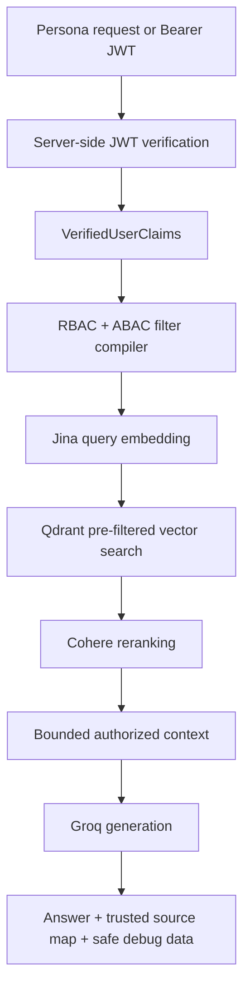

# VaultRAG

[](https://github.com/gopi-701/Vaultrag/actions/workflows/ci.yml)

Secure, authorization-aware retrieval-augmented generation for synthetic enterprise banking data.

VaultRAG is a full-stack reference implementation for a specific RAG security problem: documents that are semantically relevant are not necessarily authorized for the current user. It connects identity verification, deterministic policy compilation, vector-database filtering, reranking, bounded context construction, generation, and observability without asking an LLM to make access-control decisions.

All people, customers, companies, transactions, branches, and deals in this repository are synthetic.

## Why VaultRAG exists

A common RAG design retrieves a broad semantic result set and filters it later:

```text
retrieve → filter → generate
```

That ordering lets unauthorized content cross the retrieval boundary. It may reach application memory, logs, rerankers, tracing systems, or an LLM before a later filter removes it.

VaultRAG uses a different order:

```text
verify identity
  → compile RBAC + ABAC policy
  → apply the policy inside Qdrant vector search
  → rerank authorized results only
  → build bounded authorized context
  → generate
```

The Qdrant metadata filter is part of the same request as vector matching. Cohere and Groq receive only results returned through that pre-filtered retrieval path. The browser never creates trusted employee claims.

## Architecture



Principal implementation areas:

- `lib/auth`: canonical demo personas, JWT signing, verification, and opaque verified claims.
- `lib/authorization`: shared RBAC/ABAC semantics and Qdrant filter compilation.
- `lib/retrieval`: deterministic chunking, Jina embeddings, Qdrant setup, ingestion, reconciliation, and authorized search.
- `lib/reranking`: provider-neutral reranking and the Cohere adapter.
- `lib/llm`: bounded context construction, citation validation, and the Groq adapter.
- `lib/rag`: server-side retrieval → reranking → generation orchestration.
- `app/api`: HTTP validation and authentication boundaries.
- `components`: persona, chat, sources, and Security Inspector UI.
- `evals`: deterministic cases, metrics, and a credential-gated live runner.

See [Architecture](docs/ARCHITECTURE.md), [Security](docs/SECURITY.md), and [Threat Model](docs/THREAT_MODEL.md) for deeper detail.

## Authorization model

Every non-public chunk retains the security metadata of its source document:

- `allowedRoles`: explicit RBAC allow-list.
- `minimumClearance`: `PUBLIC` (0) through `AUDIT` (4).
- `branchId`: branch scope such as `NYC-01`.
- `clientId`: client scope such as `CUST-8832`.
- `dealId`: deal scope such as `PROJECT_APOLLO`.

Employee access requires sufficient clearance, an allowed role, and every applicable ABAC scope. Public documents use clearance zero and are available to the canonical guest. Null metadata means that dimension does not constrain the document; `ALL` follows the documented policy semantics.

The compliance officer has broad scopes and audit-level clearance, but there is no hardcoded administrator bypass. Compliance visibility exists only when document metadata explicitly allows that role and the remaining policy clauses pass.

## Tech stack

- Next.js App Router, React, TypeScript, and Tailwind CSS
- Zod runtime validation
- Vercel AI SDK with the Groq provider
- Jina embeddings (`jina-embeddings-v3` by default)
- Qdrant REST client and cosine vectors
- Cohere v2 reranking (`rerank-v4.0-pro` by default)
- JSON Web Tokens using verified HS256 signatures
- Vitest, ESLint, and GitHub Actions CI on Node.js 22

## Synthetic dataset

The corpus is stored in `data/synthetic_docs.json` and reproducibly created by `scripts/generate-synthetic-data.ts`.

It includes public banking information, branch operations, two wealth clients, cross-branch credit material, Project Apollo and Project Atlas, AML/compliance procedures, and audit records. Similar terms deliberately appear across incompatible scopes—for example Apollo versus Atlas, CUST-8832 versus CUST-9911, and NYC versus London credit policies—so semantic similarity alone is insufficient.

Selected records produce multiple overlapping chunks. Every chunk carries its source authorization metadata. No real customer PII or production banking data is included.

## Security properties

Implemented controls include:

- Employee claims are constructed and signed server-side from canonical personas.
- Chat authentication accepts only a verified Bearer JWT; JSON claims are rejected.
- `verifyToken()` pins HS256, validates the decoded payload strictly, and checks expiry.
- `VerifiedUserClaims` and authorized retrieval results use opaque TypeScript brands to preserve trusted application paths.
- Qdrant receives the compiled authorization filter before vector matching.
- Search payloads are validated before they become authorized result objects.
- Cohere receives only authorized chunk text; VaultRAG owns all metadata.
- Groq receives only the user question, trusted system instructions, and bounded authorized context.
- Retrieved document content is explicitly treated as untrusted data.
- Citations resolve only to server-owned source mappings.
- Guest access is restricted to public clearance-zero content.
- Dataset-namespaced reconciliation removes stale synthetic points without deleting unrelated Qdrant data.
- Provider and authentication failures are translated to sanitized application errors.

These are application-level controls, not a claim of complete production security. See [Security](docs/SECURITY.md).

## Local setup

Requirements:

- Node.js 22 (`.nvmrc` is included)
- npm
- A Qdrant HTTP endpoint for ingestion and live retrieval
- Jina, Cohere, and Groq credentials for live provider operations

```bash
nvm use
npm ci
cp .env.example .env.local
```

Configure `.env.local`:

| Variable | Purpose | Example/default |
| --- | --- | --- |
| `JWT_SECRET` | Demo employee JWT signing secret | Choose a strong local secret |
| `JINA_API_KEY` | Jina embedding credential | Required for ingestion and live queries |
| `EMBEDDING_PROVIDER` | Embedding provider selector | `jina` |
| `EMBEDDING_MODEL` | Supported embedding model | `jina-embeddings-v3` |
| `EMBEDDING_DIMENSION` | Collection/vector dimension | `1024` |
| `EMBEDDING_BATCH_SIZE` | Embedding batch size | `32` |
| `QDRANT_URL` | Qdrant REST endpoint | `http://localhost:6333` for local use |
| `QDRANT_API_KEY` | Optional Qdrant credential | Empty for unsecured local Qdrant |
| `QDRANT_COLLECTION` | Collection name | `vaultrag_docs` |
| `COHERE_API_KEY` | Cohere reranking credential | Required for live reranking |
| `COHERE_RERANK_MODEL` | Cohere reranking model | `rerank-v4.0-pro` |
| `GROQ_API_KEY` | Groq inference credential | Required for live generation |
| `GROQ_MODEL` | Groq model ID | Set to a model available to your account |

No secret uses a `NEXT_PUBLIC_` prefix. `.env.local` and other credential-bearing `.env*` files are ignored; `.env.example` is the only tracked environment file.

Prepare and run the application:

```bash
npm run data:generate
npm run documents:prepare -- --validate-only
npm run db:setup
npm run db:ingest
npm run dev
```

`db:setup` validates or creates the collection and payload indexes without requiring a Jina key. `db:ingest` requires Jina because it embeds the corpus.

## Testing

Normal validation is offline and uses mocked Jina, Qdrant, Cohere, and Groq boundaries:

```bash
npm run typecheck
npm run lint
npm test
npm run build
```

The optional Qdrant integration test is skipped unless its explicit integration environment is present. CI does not require production secrets or provider access.

## Evaluations

The deterministic suite contains authorization, relevance, reranking, no-context, cross-scope, and prompt-injection cases:

```bash
npm run eval:validate
npm run eval:live
```

`eval:validate` is offline. `eval:live` requires documented credentials and services, fails clearly if they are absent, and writes ignored environment-specific results under `evals/results/`.

No live benchmark numbers are published because a live evaluation has not been executed and documented against a fixed provider/service environment. See [Evaluation Suite](evals/README.md) for metric definitions.

## Limitations

- The corpus is small, synthetic, and designed for demonstrations; it does not establish production retrieval quality.
- Personas and JWT issuance are a demo mechanism, not a replacement for workforce IAM, SSO, token revocation, or lifecycle controls.
- TypeScript brands enforce trusted paths inside the typed application architecture; unsafe casts or untyped runtime consumers can bypass compile-time boundaries.
- HS256 secret rotation, refresh tokens, revocation, rate limiting, CSRF strategy, persistent audit logs, and production monitoring are not implemented.
- Hosted Jina, Cohere, Groq, and Qdrant availability, retention, residency, and commercial terms remain external dependencies.
- The character-based context budget is deterministic but not a model-specific token budget.
- Model-level semantic answer/refusal quality is not automatically judged; evaluations report only metrics with deterministic contracts.
- No production deployment or security certification is claimed.
