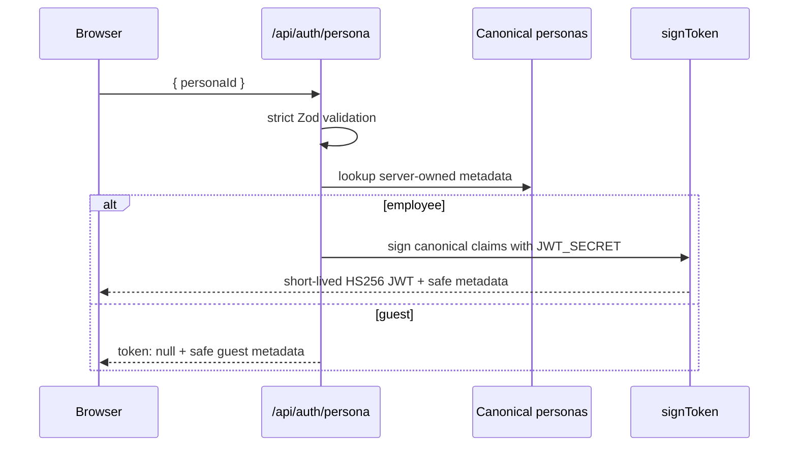
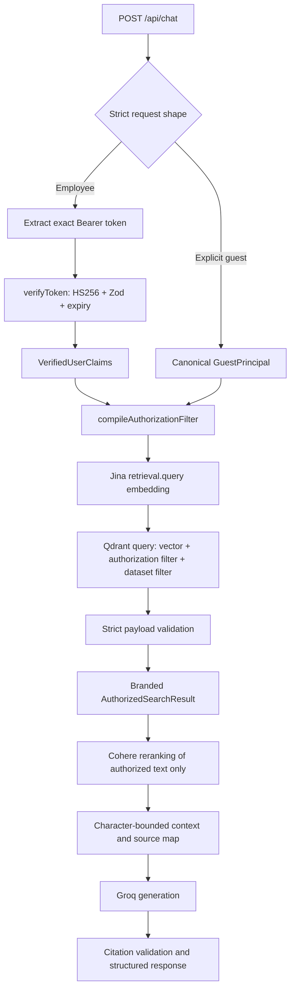

# VaultRAG architecture

VaultRAG is a Next.js App Router application that demonstrates authorization-aware RAG over a synthetic banking corpus. Its defining constraint is that authorization is enforced inside the Qdrant vector query, before results reach reranking or generation.

## Module map

| Area | Responsibility |
| --- | --- |
| `app/api/auth/persona` | Strict HTTP endpoint for requesting a canonical demo persona JWT. |
| `app/api/chat` | Strict chat request validation, Bearer extraction, JWT verification, guest selection, and sanitized HTTP errors. |
| `lib/auth` | Shared claim schemas, server-owned personas, JWT signing, and verification. |
| `lib/authorization` | Pure policy clauses, access explanation, and Qdrant filter compilation. |
| `lib/env` | Server-side Zod validation for embedding, Qdrant, reranking, and LLM configuration. |
| `lib/retrieval` | Chunking, embedding abstraction, Jina adapter, Qdrant operations, ingestion, and authorized search. |
| `lib/reranking` | Provider-neutral reranker, Cohere adapter, and authorized candidate orchestration. |
| `lib/llm` | Context/source construction, system instructions, citation validation, and Groq generation. |
| `lib/rag` | Application service that connects secure retrieval, reranking, and generation. |
| `components` | In-memory persona session, chat, trusted source cards, and Security Inspector. |
| `evals` | Deterministic case schema, ranking/security metrics, and live pipeline observations. |

Server modules that handle credentials or trusted principals import `server-only`. API routes explicitly use the Node.js runtime because they depend on Node-compatible JWT and provider SDK behavior.

## Request flow

### Demo persona issuance



The browser chooses a persona ID but cannot submit role, clearance, branch, client, or deal claims. Employee JWTs are held in React memory and replaced when personas change.

### Authorized query



`AuthorizedSearchResult` receives its opaque brand only after Qdrant has executed the filtered query and the returned payload passes runtime validation. Reranking accepts only this branded type through the authorized API. The generic reranker remains provider-neutral.

## Authorization policy

`lib/authorization` builds small shared policy clauses and uses them for both:

- `compileAuthorizationFilter(principal)`: a Qdrant filter.
- `evaluateDocumentAccess(principal, metadata)`: a pure decision plus reasons for tests and inspection.

The shared clauses reduce semantic drift. Policy dimensions are minimum clearance, explicit document roles, branch scope, client scope, and deal scope. Public documents are clearance zero and bypass the employee-role clause only because they are public—not because they are post-filtered later.

The compiled authorization filter is nested with a `datasetId` condition and sent in the same Qdrant query as the vector. The application does not perform a fallback post-retrieval authorization pass.

## Data model and ingestion

Source documents are Zod-validated and include:

```ts
{
  id, title, docType, classification, minimumClearance,
  allowedRoles, branchId, clientId, dealId, content
}
```

The chunker uses whitespace-aware 800-character windows with 120-character overlap. It normalizes whitespace deterministically and copies every security field to every chunk. Chunk indexes are sequential per document.

Document embedding inputs include title, type, and chunk content. Jina document embeddings use `retrieval.passage`; query embeddings use `retrieval.query`. Provider task strings remain inside the Jina adapter.

### Deterministic point IDs

`createPointId()` hashes:

```text
datasetId : documentId : chunkIndex
```

The SHA-256-derived value is formatted as a stable UUID-compatible string. Re-ingesting unchanged source maps to the same Qdrant points rather than creating duplicates.

### Collection setup

`db:setup` creates an unnamed dense-vector collection only when it does not exist, with the centralized embedding dimension and cosine distance. Existing vector configuration and payload index types are validated. Incompatible configuration fails clearly and is never destructively recreated.

Indexed fields are `allowedRoles`, `minimumClearance`, `branchId`, `clientId`, `dealId`, `classification`, `documentId`, and `datasetId`.

### Stale reconciliation

Prepared points are fully available and successfully upserted before reconciliation begins. The reconciliation scan is restricted to `SYNTHETIC_DATASET_ID`; only points in that namespace whose deterministic IDs are absent from the desired set are deleted. Unrelated Qdrant points are not targeted. A preparation or upsert failure prevents cleanup.

## Provider abstractions

- `EmbeddingService` exposes `embedDocuments()` and `embedQueries()` and validates batching, counts, finite values, and dimensions.
- `Reranker<T>` accepts provider-neutral documents and maps provider indexes back to VaultRAG-owned objects.
- `GenerationProvider` accepts only a trusted system string and prepared prompt and returns text plus optional usage.

Jina, Cohere, and Groq code is isolated in provider adapters. API keys are obtained through server-side validated environment configuration and are not included in application result models.

## Reranking and context construction

Secure retrieval returns up to 20 authorized candidates by default. Cohere selects up to 5. The original Qdrant similarity score remains intact and the Cohere score is added separately.

Context construction:

- Preserves reranked order.
- Assigns deterministic user-facing citation IDs (`C1`, `C2`, …) only after a source fits.
- Serializes each source as a clearly delimited untrusted-data block.
- Stops before the centralized 12,000-character budget would be exceeded.
- Keeps trusted source metadata outside model-generated text.

If no source fits, Groq is not constructed or called; a deterministic insufficient-authorized-context response is returned.

## Generation and citations

The system prompt tells the model to answer only from supplied context, treat documents as untrusted data, ignore embedded instructions, cite known source IDs, and avoid inferring inaccessible information.

After generation, citation markers matching `[C<number>]` are checked against the supplied source map. Unsupported markers are removed, and `citedSources` is derived only from known server-owned records. The model cannot create source metadata.

## Frontend state and observability

The frontend stores the demo JWT only in React memory. Persona changes clear the prior credential and conversation, invalidate and abort active chat work, and ignore stale responses. Guest requests carry an explicit guest marker and no Authorization header.

The Security Inspector renders server-produced identity, scopes, compiled filter, authorized candidate counts, source scores, and latency. It does not receive JWTs, provider credentials, hidden prompts, unauthorized result text, or hypothetical post-filter block counts.

## Evaluation architecture

Offline tests validate case schemas and deterministic metric math. The live runner uses the production secure retrieval, reranking, and generation modules and records:

- Document-level retrieval and reranking metrics after first-occurrence deduplication.
- Policy-derived authorization violation rates at both Qdrant and final-context boundaries.
- Explicit forbidden-document fixture rates as a separate adversarial metric.
- Deterministic no-context and context-availability behavior.

Live results are environment-specific, require explicit credentials, and are ignored by Git.
