# VaultRAG threat model

## Scope

This threat model covers the application code, synthetic ingestion pipeline, authorization-aware retrieval flow, provider adapters, demo persona API, and browser UI in this repository. It does not model a specific cloud/network deployment because none is included.

## Assets

- Restricted document and chunk content.
- Authorization metadata (`allowedRoles`, clearance, branch, client, and deal scopes).
- JWT signing secret and signed employee tokens.
- Jina, Qdrant, Cohere, and Groq credentials.
- Vector collection integrity, deterministic point IDs, and dataset namespace.
- Trusted source/citation mappings and security-debug accuracy.

## Threat actors

- **Unauthenticated guest:** attempts to access employee or restricted material.
- **Authenticated low-privilege user:** has a valid demo JWT but attempts cross-role or cross-scope retrieval.
- **Malicious client:** sends altered JSON, forged tokens, ambiguous guest/employee requests, or adversarial queries.
- **Developer or configuration mistake:** misconfigures indexes/dimensions, drops metadata, exposes secrets, bypasses trusted types, or leaves stale vectors.
- **Malicious document content:** contains instructions intended to manipulate the LLM after authorized retrieval.
- **External provider/account compromise:** can affect data handled by hosted services; primarily a deployment/vendor risk.

## Trust boundaries

```mermaid
flowchart LR
    Browser[Untrusted browser input] --> API[Next.js API boundary]
    API --> Auth[JWT verification / canonical guest]
    Auth --> Policy[Policy compiler]
    Policy --> Qdrant[Qdrant filtered-search boundary]
    Qdrant --> Cohere[Cohere authorized-text boundary]
    Cohere --> Context[Bounded context builder]
    Context --> Groq[Groq generation boundary]
    Groq --> Output[Validated citations + server sources]
```

Browser claims and document instructions are untrusted. Verified claims, compiled filters, branded search results, and server-owned source maps are trusted only within their documented application boundaries.

## Threat analysis

| Threat | Attack path | Implemented mitigation | Residual risk | Test/evaluation coverage |
| --- | --- | --- | --- | --- |
| JWT tampering | Modify token payload/signature to increase clearance or scopes. | HS256 signature verification, algorithm pinning, strict claim schema, expiry check. | Demo lacks issuer/audience, revocation, rotation, and production IdP controls. | Valid, tampered, expired, wrong-secret, and malformed-token unit/API tests. |
| Privilege escalation through request JSON | Submit `role`, `clearanceLevel`, `branchIds`, `clientIds`, `dealIds`, or `sub` to chat/persona APIs. | Strict request schemas; canonical claims are server-owned; chat uses Bearer JWT only for employees. | A future non-strict endpoint or unsafe server code could reintroduce trust in client claims. | Persona elevation and forged chat-field tests; evaluation fake-claims query. |
| Forged structurally valid claims | Application code constructs a claims-shaped object without JWT verification. | Private `VerifiedUserClaims` brand; retrieval accepts only verified claims or canonical guest; no public branding helper. | TypeScript brands can be bypassed with explicit unsafe casts or untyped code. | Compile-time `@ts-expect-error` regression tests and verified-token retrieval tests. |
| Cross-branch access | NYC employee asks for London/SFO operational content. | Branch clause compiled into the Qdrant pre-filter; chunk metadata preserved through ingestion. | Incorrect source metadata or policy changes could grant access; no external IAM source validates persona scopes. | Authorization/search tests and NYC/London adversarial evaluation cases. |
| Cross-client access | Wealth manager for CUST-8832 requests CUST-9911 documents. | Client clause in Qdrant filter; canonical client scope. | Data classification/metadata mistakes remain possible. | Wealth isolation unit/search tests and cross-client evaluation case. |
| Cross-deal access | Apollo banker requests Atlas deal material. | Deal clause in Qdrant filter; canonical Apollo scope; explicit document roles. | Incorrect deal IDs or allowed-role metadata could authorize a record. | Apollo/Atlas authorization/search tests and adversarial evaluation cases. |
| Retrieval-before-filter leakage | Broad vector search returns unauthorized chunks for later filtering. | Authorization filter and dataset filter are included in the same Qdrant vector query; no post-retrieval fallback. | Qdrant/server defects or policy compilation bugs; debug telemetry alone is not enforcement proof. | Mock request assertions verify the exact filter; retrieval and context authorization-violation eval metrics. |
| Compliance hardcoded bypass | Special-case role logic returns all documents. | Compliance uses the same clauses; broad access comes from claims plus explicit document roles. | Overbroad metadata can still authorize content. | Compliance access/no-bypass authorization tests and explicit audit cases. |
| Prompt injection in user query | User asks model to ignore permissions, reveal prompts, or accept fake claims. | Authorization is completed before generation and never delegated to the model; strict HTTP auth boundary. | Model may still produce poor or misleading text from authorized context. | User-query injection evaluation cases; no claim of automatic semantic refusal scoring. |
| Prompt injection in document | Authorized document tells model to override instructions or reveal other content. | Delimited untrusted-data blocks, defensive system prompt, bounded authorized context, no additional retrieval controlled by the model. | Prompt defenses are probabilistic; authorized malicious text may influence generated wording. | Generator/context unit tests and controlled retrieved-document injection evaluation fixture. |
| Source or citation fabrication | Model emits unknown citation IDs or source-looking JSON. | Server constructs sources from context; citation validator removes unsupported IDs; model output is never parsed into source objects. | Model can still make uncited or incorrect statements; citation validation is intentionally simple. | LLM and RAG source-mapping tests, including unsupported citations and fake source-like text. |
| Stale vector exposure | Removed documents or reduced chunk counts leave old authorized/unauthorized points searchable. | Deterministic IDs, dataset namespace, post-upsert reconciliation, cleanup only after successful replacement. | Process interruption after partial upserts can leave mixed current data until a successful rerun; no transaction spans the full workflow. | Idempotency, removed document, reduced chunks, failed-upsert, and unrelated-point tests. |
| Authorization metadata loss during chunking/ingestion | A chunk is stored without role/scope/clearance metadata. | Zod source validation, exact metadata copying, prepared payload types, strict search-payload validation. | Incorrect metadata in the source itself is not independently classified by this application. | Chunk/preparation/ingestion metadata preservation tests. |
| Malformed provider response | Provider returns missing vectors, wrong dimensions, duplicate rerank indexes, non-finite scores, or malformed payload. | Central structural/count/dimension/index validation; failures stop the pipeline. | Provider quality can degrade while remaining structurally valid. | Embedding, Jina, Cohere, reranker, Qdrant, and payload tests. |
| Credential leakage | Secrets appear in client bundle, logs, errors, responses, Git, or debug inspector. | Server-only env access, no `NEXT_PUBLIC_` secrets, ignored env files, sanitized errors, debug allow-list, CI without credentials. | Operators or future logging changes can leak credentials; Git history must still be monitored. | API/provider sanitization tests, rendered-inspector tests, repository secret scan during hardening. |
| Guest ambiguity or silent downgrade | Missing/invalid employee JWT becomes guest, or guest body carries an employee token. | Guest must be explicit; employee missing/invalid token is 401; guest plus Authorization is 400; no automatic guest retry. | Demo UX switches local state to guest after a current 401 but does not replay the employee query. | Chat API and frontend concurrency/session tests. |
| Stale browser response | Persona A response arrives after switching to persona B and overwrites state/session. | Monotonic request generation, AbortController, current-request checks before every mutation, unmount cleanup. | Abort is cooperative at the network layer, so correctness still relies on generation checks. | Stale success, stale 401, abort, duplicate, new-query, and unmount tests. |
| Destructive collection setup | Setup silently recreates or changes an incompatible collection/index. | Existing vector size, cosine distance, and payload index types are validated; setup fails instead of recreating. | Manual operator changes outside the script remain possible. | Collection and index compatibility tests. |
| Cross-dataset deletion | Reconciliation deletes unrelated Qdrant points. | Scroll/delete filter is restricted to the VaultRAG synthetic dataset namespace. | Sharing a collection with another producer that incorrectly reuses the same namespace is unsafe. | Unrelated-point preservation and stale reconciliation tests. |

## Security assumptions and gaps

- Synthetic source metadata is assumed to be intentionally assigned; VaultRAG enforces it but does not classify documents automatically.
- Qdrant and provider HTTP connections, network policy, TLS termination, service accounts, and secret managers belong to the deployment environment.
- There is no rate limiting, abuse throttling, persistent security audit log, malware scanning, DLP engine, or content moderation layer.
- Demo JWTs use one symmetric secret and short expiry; production IAM features are outside scope.
- Provider prompts and authorized data leave the application boundary according to each provider's service configuration.
- LLM prompt-injection defenses reduce exposure but do not guarantee semantic correctness.

## Validation strategy

Normal CI runs without provider credentials and uses mocked external boundaries. The deterministic evaluation suite validates metric semantics and defines adversarial cases. Live evaluation is separate, credential-gated, and must not be treated as a benchmark until run against documented provider and corpus versions.
